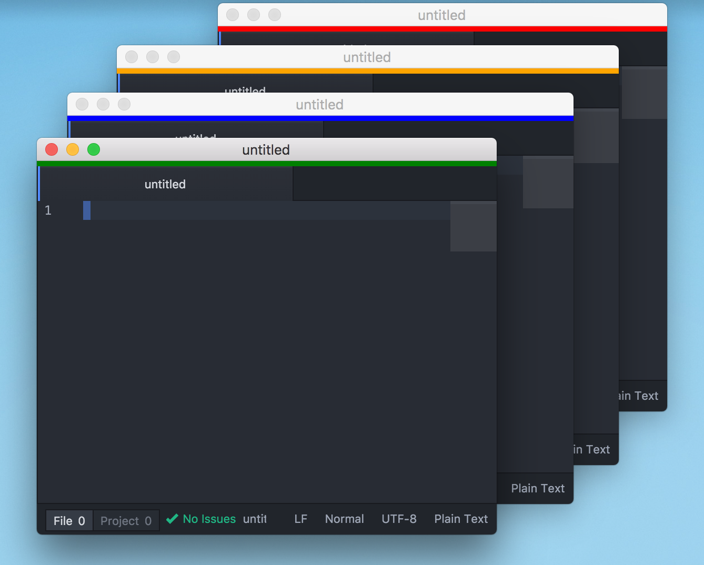

# rainbow-windows package

Adds a color strip to the top of your window to help discern between windows.

## Usage

Select `Rainbow Windows: Toggle` in the command palette (`cmd-shift-p` on mac, `ctrl-shift-p` on windows and linux) to toggle the color bar on the current window.
